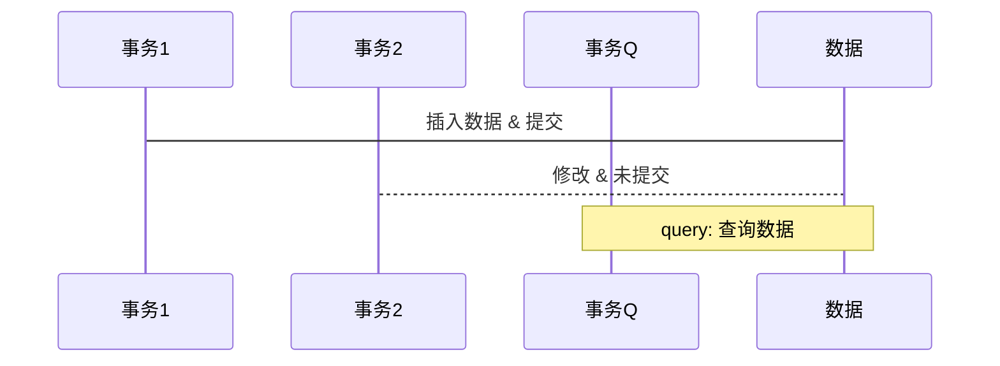
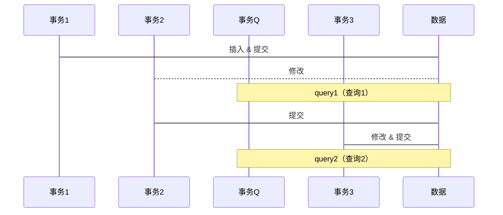

# 理解 InnoDB MVCC 机制

MVCC，全称 Multi-Version Concurrency Control，即多版本并发控制。

**多版本并发控制（Multi-version Concurrency Control）**: 指的是一种提高并发的技术。最早的数据库系统，只有读读之间可以并发，读写，写读，写写都要阻塞。引入多版本之后，**只有写写之间相互阻塞**，其他三种操作都可以并行，这样大幅度提高了InnoDB的并发度。
MVCC在 Read Committed 和 Repeatable Read两个隔离级别下工作。

要理解数据库的 MVCC 需要先了解数据库的[事务隔离级别](https://azh3ng.com/mysql/2021/09/21/%E7%90%86%E8%A7%A3%E4%BA%8B%E5%8A%A1%E9%9A%94%E7%A6%BB%E7%95%8C%E5%88%AB.html)。  
其中 Read Uncommitted 几乎没有隔离性，所以无需做任何处理；
Serializable 要保证每个事务强隔离，所以对每个事务强行串行化，所以无需考虑并发导致的数据不一致。  
但是 Read Commited 和 Repeatable Read 需要保证读取到的数据的一致性。  
Read Commited 不能读到其他事务未提交的修改，Repeatable Read 在此基础上还需要保证当前事务中每次读取到的数据都是一致的。

---

思考如果自己实现这一功能，首先想到的笨办法就是在开启事务的瞬间，把所有数据进行完整备份，在备份上进行查询和修改，但是当数据库的数据量变得很大这种方式的性能极低以至于不可用。  
其次想到的是对于事务修改的表或者行进行加锁，其他事务无法同时查询或修改，对于事务的查询同样进行加锁，其他事务无法同时修改。但是这在高并发的场景下性能一样很差。  
如果对于未提交的插入/修改/删除，仅仅只存在于内存中，并不持久化呢？这样其他的事务也就看不见所做的修改，
但是当一个事务内包含大量的查询、插入、修改、删除操作，会需要更加复杂的逻辑保持事务内数据的准确。

---
或者对一行数据插入、修改、删除操作并不立刻覆盖原有数据，而是在每次进行修改的时候，保留并复制原数据，在复制出来的数据上做修改呢([Undo log](#Undo log))？然后给每个事务记一个编号，再记录下来这次修改是哪个事务作的，并且记录这个数据修改之前的原数据的地址（[隐藏字段](#隐藏字段)），这样在查询时，只需要弄清楚哪些事务的数据是已提交的，哪些数据是未提交的不可见的（[Read View](#Read View)），判断数据的可见性，如果不可见，就找到这条数据的上一个版本，继续判断，如果数据可见就返回（[[#可见性比较算法]]），这样就可以保证在写的同时可以读（提高并发性能），并且能保证读不到未提交的数据（Read Commited），事务内每次查询都使用相同的 Read View，也可以保证当前书屋中每次读取到的数据都是一致的（Repeatable Read），还能还能[防止部分幻读](#当前读和快照读)。

实际上 InnoDB 的 MVCC 机制就是这样做的。
它的做法是对每一行数据维护一个**修改链**，每次修改都将原始行数据进行备份、修改，并添加到修改链的头部，
同时在行中添加两个隐藏的列`DB_TRX_ID`和`DB_ROLL_PTR`，其中`DB_TRX_ID`记录此次修改的**事务ID**，另一列`DB_ROLL_PTR`指向**修改前的数据**（这么说只是为了方便，实际指向的是 [Undo log](#Undo log) 中的记录）。  
数据库对事务ID进行强制的升序分配，这样事务在查询数据时就可以根据事务ID的大小来判断数据是否可见。  
也就是 MVCC 主要依赖**Undo log**、**隐藏字段**、**Read View**、**可见性比较**实现。  
对于同步写操作通过加锁解决冲突。

## Undo log
Undo log中存储的是老版本数据。当一个事务需要读取记录行时，如果当前记录行不可见，可以顺着 Undo log 链找到满足其可见性条件的版本的记录行。

大多数对数据的变更操作包括 insert/update/delete，在InnoDB里，Undo log 分为如下两类：
1. insert undo log : 事务对 insert 新记录时产生的 undo log，只在事务回滚时需要, 并且在事务提交后就可以立即丢弃。
2. update undo log : 事务对记录进行 delete 和 update 操作时产生的 undo log，不仅在事务回滚时需要，快照读也需要，只有当数据库所使用的快照中不涉及该日志记录，对应的回滚日志才会被purge线程删除。

> Purge线程：为了实现InnoDB的MVCC机制，更新或者删除操作都只是设置一下旧记录的deleted_bit，并不真正将旧记录删除。
> 为了节省磁盘空间，InnoDB有专门的purge线程来清理deleted_bit为true的记录。purge线程自己也维护了一个read view，如果某个记录的deleted_bit为true，并且DB_TRX_ID相对于purge线程的read view可见，那么这条记录一定是可以被安全清除的。

## 隐藏字段
InnoDB存储引擎在每行数据的后面添加了三个隐藏字段：
1. `DB_TRX_ID`(6字节)：表示最后一次对本记录行作修改（insert | update）的事务标识符（事务ID）。此外 delete 操作被 InnoDB 认作一种update 操作，行中的一个特殊的位（a special bit）用来标记该行被删除，并非真正物理删除。
2. `DB_ROLL_PTR`(7字节)：回滚指针，指向当前记录行的 undo log 信息。
3. `DB_ROW_ID`(6字节)：随着新行插入而单调递增的行ID。当表**没有**`主键`或`唯一非空索引`时，InnoDB 就会使用这个`DB_ROW_ID`自动生成索引。否则`DB_ROW_ID`列不会出现在任何索引中，`DB_ROW_ID`跟 MVCC 关系不大。
   官方文档：[14.3 InnoDB Multi-Versioning](https://dev.mysql.com/doc/refman/5.7/en/innodb-multi-versioning.html)

### 示例
假设有一张表`t_table`，表里有两个字段`id`和`name`，其中`id`为主键
```sql
CREATE TABLE t_table(
   id INT UNSIGNED AUTO_INCREMENT,
   name VARCHAR(100) NOT NULL,
   PRIMARY KEY ( id )
);
```

假设有一条记录：`id` 和 `name` 的值分别为 "1" 和 "tom"，最新修改这条记录的事务ID为 100：

| id  | name | DB_TRX_ID | DB_ROLL_PTR(回滚指针) |
| --- | ---- | --------- | --------------------- |
| 1   | tom  | 100       | 0x12345670             |

现在有一个事务A（事务ID为 101）对这条记录的`name`字段进行修改：`update t_table set name = 'bob' where id = 1`：
1. 事务A对这条记录加排他锁
2. 将旧数据复制到 Undo log 中，作为旧版本
3. 修改数据`name`字段为“bob”，修改`DB_TRX_ID`为 101，DB_ROLL_PTR(回滚指针)指向步骤2的 Undo log 旧版本数据
4. 事务提交，释放排它锁

此时数据如下：

| 说明             | id  | name     | DB_TRX_ID | DB_ROLL_PTR(回滚指针) | Undo log 地址 |
| ---------------- | --- | -------- | --------- | --------------------- | ------------- |
| 修改后的最新数据 | 1   | bob      | 101       | 0x12345671            | -             |
| Undo log 分割线           | --- | --- | ---       | ---                   | ---           |
| Undo log         | 1   | tom      | 100       | 0x12345670            | 0x12345671    |

现在有一个事务B（事务ID为 102）对这条记录的`name`字段进行修改：`update t_table set name = 'mike' where id = 1`，步骤同上，此时数据如下

| 说明             | id  | name     | DB_TRX_ID | DB_ROLL_PTR(回滚指针) | Undo log 地址 |
| ---------------- | --- | -------- | --------- | --------------------- | ------------- |
| 修改后的最新数据 | 1   | mike      | 102       | 0x12345672            | -             |
| Undo log 分割线           | --- | --- | ---       | ---                   | ---           |
| Undo log         | 1   | bob      | 101       | 0x12345671            | 0x12345672    |
| Undo log         | 1   | tom      | 100       | 0x12345670            | 0x12345671    |

以此类推，从上表可以看出，不同事务对于一行记录的修改，通过 Undo log 的连接，使其近似于一条链表，链表的头就是最新数据，下一个节点就是上一个版本的旧数据，链表的尾部就是数据的最早的旧数据。

## Read View
Read View （视图）记录了**当前事务ID**、**当前事务不可见的其他事务ID**。  
在开启事务的时刻不会创建 Read View，只有在进行查询（包括增删改操作）时，才会创建 ReadView。在[可见性比较算法](#可见性比较算法)时会用到。  
[Read View 结构源码](https://github.com/facebook/mysql-5.6/blob/42a5444d52f264682c7805bf8117dd884095c476/storage/innobase/include/read0read.h#L125)：
> ```
> struct read_view_t{
>   ulint		type;	/*!< VIEW_NORMAL, VIEW_HIGH_GRANULARITY */
> 	undo_no_t	undo_no;/*!< 0 or if type is
> 				VIEW_HIGH_GRANULARITY
> 				transaction undo_no when this high-granularity
> 				consistent read view was created */
> 	trx_id_t	low_limit_no;
> 				/*!< The view does not need to see the undo
> 				logs for transactions whose transaction number
> 				is strictly smaller (<) than this value: they
> 				can be removed in purge if not needed by other
> 				views */
> 	trx_id_t	low_limit_id;
> 				/*!< The read should not see any transaction
> 				with trx id >= this value. In other words,
> 				this is the "high water mark". */
> 	trx_id_t	up_limit_id;
> 				/*!< The read should see all trx ids which
> 				are strictly smaller (<) than this value.
> 				In other words,
> 				this is the "low water mark". */
> 	ulint		n_trx_ids;
> 				/*!< Number of cells in the trx_ids array */
> 	trx_id_t*	trx_ids;/*!< Additional trx ids which the read should
> 				not see: typically, these are the read-write
> 				active transactions at the time when the read
> 				is serialized, except the reading transaction
> 				itself; the trx ids in this array are in a
> 				descending order. These trx_ids should be
> 				between the "low" and "high" water marks,
> 				that is, up_limit_id and low_limit_id. */
> 	trx_id_t	creator_trx_id;
> 				/*!< trx id of creating transaction, or
> 				0 used in purge */
> 	UT_LIST_NODE_T(read_view_t) view_list;
> 				/*!< List of read views in trx_sys */
> };
> ```

其中主要的变量有[low_limit_id](#low_limit_id)、[up_limit_id](#up_limit_id)、[trx_ids](#trx_ids)、[creator_trx_id](#creator_trx_id)
### low_limit_id
也被称作高水位（high water mark）  
其表示下一个将要被分配到的事务ID，也就是目前出现过最大的事务ID + 1。也即：如果查到的数据的`DB_TRX_ID`大于等于`low_limit_id`，表示这条数据对于这个事务来说不可见。
### up_limit_id
也被称作低水位（low water mark）  
其表示活跃事务列表（`trx_ids`）中最小的事务 ID，如果`trx_ids`为空，则`up_limit_id = low_limit_id`。
### trx_ids
其记录了 Read View 创建时，所有未提交的活跃的事务列表。故而这些事务中对数据的插入、修改、删除操作对于当前事务应当都是不可见的。  
其中**不**包括当前事务ID 和 已提交的事务ID，并且`trx_ids`一定在高水位和低水位之间。
### creator_trx_id
当前事务的ID，数据库强制使分配的事务ID递增。

## 可见性比较算法
在 InnoDB 中，创建一个新事务后，执行第一个 select 语句的时候，InnoDB 会创建一个快照（Read View），当当前事务读取某行记录的时候，InnoDB 会拿这记录行的`DB_TRX_ID`与Read View 中的变量进行比较，判断是否满足可见性条件。
假设当前事务的 select 语句查询到一行数据，这行记录的`DB_TRX_ID`是`trx_id`。
Read View 中的
- `creator_trx_id`记录当前事务ID；
- `low_limit_id`记录数据库中最大事务ID+1；
- `trx_ids`记录当前所有活跃（未提交：数据对于当前事务不可见）的事务ID；
- `up_limit_id`记录`trx_ids`中的最小值。

具体比较逻辑如下：
1. 如果数据的`trx_id`= `creator_trx_id`，表示这条数据是自己插入或修改的，可以读到，返回数据，结束。
2. 如果数据的`trx_id` < `min_trx_id`，表示这个版本的数据是在当前所有活跃事务之前修改的，并且已经提交，可以读到，返回数据，结束。
3. 如果数据的`trx_id` >= `low_limit_id`，表示数据在当前事务生成 Read View后才开启，所以该版本不可以被读出来，转到步骤 5。
4. 如果数据的`up_limit_id` <= `trx_id` < `low_limit_id`之间，表示这条数据在创建 Read View 的时候可能处于“未提交事务”或者“已提交事务”，所以继续通过二分法查找`trx_id`在不在`trx_ids`（有序）中：
    1. 如果在，说明创建 Read View 的时候，生成该版本的事务还是活跃的（没有被提交），该版本不可以被读出来，转到步骤 5；
    2. 如果不在，说明创建 Read View 的时候，生成该版本的事务已经被提交了，该版本可以被读出来，返回数据，结束；
5. 根据这行数据的`DB_ROLL_PTR`，找到 undo log 修改链中这行数据的上一个版本，拿到这行数据上个版本的 `DB_TRX_ID`，赋值给`trx_id`，转到步骤 1 重新开始判断。  
   总之根据这行数据的`DB_TRX_ID`和 Read View 中记录的事务ID做比较，如果结果可见，则返回数据，如果结果不可见，则顺`DB_ROLL_PTR`找到上一个版本的数据，继续做上述判断。如果找到版本链最末尾的的数据判断还是不可见，则表示该数据对当前事务完全不可见，查询结果就不应该包含这条记录了。

[比较逻辑的源码](https://github.com/facebook/mysql-5.6/blob/42a5444d52f264682c7805bf8117dd884095c476/storage/innobase/include/read0read.ic#L84)：
> ```
> /*********************************************************************//**
> Checks if a read view sees the specified transaction.
> @return	true if sees */
> UNIV_INLINE
> bool
> read_view_sees_trx_id(
> 	const read_view_t*	view,	/*!< in: read view */
> 	trx_id_t		trx_id)	/*!< in: trx id */
> {
> 	if (trx_id < view->up_limit_id) {
> 
> 		return(true);
> 	} else if (trx_id >= view->low_limit_id) {
> 
> 		return(false);
> 	} else {
> 		ulint	lower = 0;
> 		ulint	upper = view->n_trx_ids - 1;
> 
> 		ut_a(view->n_trx_ids > 0);
> 
> 		do {
> 			ulint		mid	= (lower + upper) >> 1;
> 			trx_id_t	mid_id	= view->trx_ids[mid];
> 
> 			if (mid_id == trx_id) {
> 				return(FALSE);
> 			} else if (mid_id < trx_id) {
> 				if (mid > 0) {
> 					upper = mid - 1;
> 				} else {
> 					break;
> 				}
> 			} else {
> 				lower = mid + 1;
> 			}
> 		} while (lower <= upper);
> 	}
> 
> 	return(true);
> }
> ```

## Read Commited 和 Repeatable Read 的区别
- 在 **Read Committed**级别, 事务开始之后，执行**每条**select（读操作）语句时，快照会被重置，即会重新创建一个快照(read view)，即可保证查询结果中没有其他未提交事务的修改。
- 在 **Repeatable Read**级别, 事务开始之后，执行**第一条**select（读操作）时，会创建一个快照(Read View)，将当前系统中活跃的其他事务记录起来；并且事务之后都是使用的这个快照，不会重新创建，直到事务结束，即可保证每次查询的结果一致，也即“可重复读”。

## 当前读和快照读
- **快照读(snapshot read)**：普通的 select 语句(不包括 select ... lock in share mode, select ... for update)
- **当前读(current read)**：`select ... lock in share mode`，`select ... for update`，`insert`，`update`，`delete` 语句（这些语句获取的是数据库中的最新数据，[官方文档：14.7.2.4 Locking Reads](https://dev.mysql.com/doc/refman/5.7/en/innodb-locking-reads.html) ）

比如事务A开始后，执行普通select语句，创建了快照；之后事务B执行insert语句；然后事务A再执行普通 select 语句，得到的还是之前B没有 insert 过的数据，因为这时候A读的数据是符合快照可见性条件的数据。这就防止了部分幻读，此时事务A是快照读。

但是，如果事务A执行的是`select ... for update`等语句，这时候，事务A是**当前读**，每次语句执行的时候都是获取的最新数据。也就是说，在只有MVCC时，A先执行`select ... where nid between 1 and 10 … for update`；然后事务B再执行`insert … nid = 5 …`；然后 A 再执行`select ... where nid between 1 and 10 … for update`，就查询到 B 插入进去的记录，这就产生幻读了，所以单独靠MVCC并不能完全防止幻读。
因此，InnoDB在实现RR隔离级别时，不仅使用了MVCC，还会对“当前读语句”读取的记录行加记录锁（record lock）和间隙锁（gap lock），禁止其他事务在间隙间插入记录行，来防止幻读。

## 场景一：Read Commited
以 Read Commited 为例，说明 MVCC 如何实现：不读到其他事务未提交的修改  
以[示例](#示例)中的表`t_table`为例  
现在假设分别有三个事务操作：

- `事务1`（事务ID：100）插入数据，且已提交：`insert into t_table values(1, "tom");commit;`
- `事务2`（事务ID：101）修改，还未提交：`update t_table set name = "bob" where id = 1;`
- `事务Q`（事务ID：999）查询数据：`select * from t_table where id = 1;`

此时表数据如下：

| 说明             | id  | name     | DB_TRX_ID | DB_ROLL_PTR(回滚指针) | Undo log 地址 |
| ---------------- | --- | -------- | --------- | --------------------- | ------------- |
| 修改后的最新数据 | 1   | bob      | 101       | 0x12345671            | 无             |
| Undo log 分割线           | --- | --- | ---       | ---                   | ---           |
| Undo log         | 1   | tom      | 100       | 无            | 0x12345671    |

此时`事务Q`的 Read View 如下：

- `creator_trx_id`（记录当前事务ID）：999
- `low_limit_id`（记录数据库中最大事务ID+1）：101 + 1 =102
- `trx_ids`（当前所有活跃未提交的事务ID）：101（事务2）
- `up_limit_id`（`trx_ids`中的最小值）：101

`事务Q`查出来的是最新数据：

| id  | name | DB_TRX_ID |
| --- | ---- | --------- |
| 1   | bob  | 101       |

`trx_id`：等于数据的 DB_TRX_ID，即为 101  
根据[可见性比较算法](#可见性比较算法)判断：
1. 101（`trx_id`）**不**等于 999（`creator_trx_id`），数据**不**为当前线程创建，继续判断；
2. 101（`trx_id`）**不**小于 101（`up_limit_id`），表示数据在 Read View 中**不**是已提交状态，继续判断；
3. 101（`trx_id`）**不**大于等于 102（`low_limit_id`），表示数据不是 生成 Read View 后才写入，继续判断；
4. 101（`trx_id`）在`up_limit_id`和`low_limit_id`之间，并且 `trx_ids`中包含`trx_id`，表示创建 Read View 时，数据是未提交状态，则该版本不可以被读出来
5. 根据数据的`DB_ROLL_PTR`找到上一版本的数据：

| id  | name | DB_TRX_ID |
| --- | ---- | --------- |
| 1   | tom  | 100       |

6. `trx_id`被赋值为新的`DB_TRX_ID`，即为 100
7. 100（`trx_id`）**不**等于 999（`creator_trx_id`），数据不为当前线程创建，继续判断；
8. 100（`trx_id`）**小于** 101（`up_limit_id`），表示数据在 Read View 中是已提交状态，表示数据对于当前 Read View 可见，即返回数据
9. 最终查到的数据为：

| id  | name | 
| --- | ---- | 
| 1   | tom  | 

是想要查到的数据，实现了 Read Commited 级别的隔离，查询没有读到其他事务未提交的修改。


## 场景二：Repeatable Read

以 Repeatable Read 为例，思考如何实现在并发情况下，当前事务的修改不被其他事务读取，自己读取不到其他未提交事务的修改，同时当前事务中每次读取都是一致的。  
同样以[示例](#示例)中的表`t_table`为例    
假设有 4 个事务操作


1. `事务1`（事务ID：100）插入数据，且已提交：`insert into t_table values(1, "tom");commit;`
2. `事务2`（事务ID：101）修改，还未提交：`update t_table set name = "bob" where id = 1;`
3. `事务Q`（事务ID：999）查询数据：`select * from t_table where id = 1;`
4. `事务2`（事务ID：101）提交修改：`commit`
5. `事务3`（事务ID：102）修改，提交：`update t_table set name = "mike" where id = 1; commit;`
6. `事务Q`（事务ID：999）查询数据：`select * from t_table where id = 1;`

此时表数据如下：

| 说明             | id  | name | DB_TRX_ID | DB_ROLL_PTR(回滚指针) | Undo log 地址 |   
| ---------------- | --- | ---- | --------- | --------------------- | ------------- |
| 修改后的最新数据 | 1   | mike | 102       | 0x12345672            | 无            |    
| Undo log 分割线  | --- | ---  | ---       | ---                   | ---           |     
| Undo log         | 1   | bob  | 101       | 0x12345671            | 0x12345672    |     
| Undo log         | 1   | tom  | 100       | 无                    | 0x12345671    |    

第一次查询的结果为

| id  | name | 
| --- | ---- | 
| 1   | tom  | 

与[场景一：Read Commited](#场景一：Read Commited)相同，不再赘述。

---

**第二次查询**，由于事务隔离级别是`Repeatable Read`，所以 Read View 和第一次的相同   
此时`事务Q`的 Read View 如下（与[[#场景一：Read Commited]]相同）：

- `creator_trx_id`（记录当前事务ID）：999
- `low_limit_id`（记录数据库中最大事务ID+1）：101 + 1 =102
- `trx_ids`（当前所有活跃未提交的事务ID）：101（事务2）
- `up_limit_id`（`trx_ids`中的最小值）：101

第二次查询，`事务Q`查出来的是最新数据：

| id  | name | DB_TRX_ID |
| --- | ---- | --------- |
| 1   | mike | 102 |

`trx_id`：等于数据的 DB_TRX_ID，即为 102  
根据[[#可见性比较算法]]判断：
1. 102（`trx_id`）**不**等于 999（`creator_trx_id`），数据**不**为当前线程创建，继续判断；
2. 102（`trx_id`）**不**小于 101（`up_limit_id`），表示数据在 Read View 中**不**是已提交状态，继续判断；
3. 102（`trx_id`）**大于等于** 102（`low_limit_id`），表示数据不是 生成 Read View 后才写入，该版本不可以被读出来；
5. 根据数据的`DB_ROLL_PTR`找到上一版本的数据：

| id  | name | DB_TRX_ID |
| --- | ---- | --------- |
| 1   | bob  | 101       |

6. `trx_id`被赋值为新的`DB_TRX_ID`，即为 101
7. 101（`trx_id`）**不**等于 999（`creator_trx_id`），数据**不**为当前线程创建，继续判断；
8. 101（`trx_id`）**不**小于 101（`up_limit_id`），表示数据在 Read View 中**不**是已提交状态，继续判断；
9. 101（`trx_id`）**不**大于等于 102（`low_limit_id`），表示数据不是 生成 Read View 后才写入，继续判断；
10. 101（`trx_id`）在`up_limit_id`和`low_limit_id`之间，并且 `trx_ids`中包含`trx_id`，表示创建 Read View 时，数据是未提交状态，则该版本不可以被读出来
11. 根据数据的`DB_ROLL_PTR`找到上一版本的数据：

| id  | name | DB_TRX_ID |
| --- | ---- | --------- |
| 1   | tom  | 100       |

12. `trx_id`被赋值为新的`DB_TRX_ID`，即为 100
13. 100（`trx_id`）**不**等于 999（`creator_trx_id`），数据不为当前线程创建，继续判断；
14. 100（`trx_id`）**小于** 101（`up_limit_id`），表示数据在 Read View 中是已提交状态，表示数据对于当前 Read View 可见，即返回数据
15. 最终查到的数据为：

| id  | name | 
| --- | ---- | 
| 1   | tom  | 

两次查询结果相同，实现了 Repeatable Read 级别的隔离，查询没有读到其他事务未提交的修改，没有读到事务开启之后的数据修改，并且两次查询结果相同。


## 参考
- <https://www.cnblogs.com/CodeBear/p/12710670.html>
- <https://segmentfault.com/a/1190000039809030>
- <https://www.leviathan.vip/2019/03/20/InnoDB%E7%9A%84%E4%BA%8B%E5%8A%A1%E5%88%86%E6%9E%90-MVCC/>
- <https://blog.csdn.net/Waves___/article/details/105295060>
- <https://dev.mysql.com/doc/refman/5.7/en/innodb-multi-versioning.html>
- <https://www.cnblogs.com/cswiki/p/15338928.html>
- <https://blog.csdn.net/Win_Dan/article/details/119171531>  