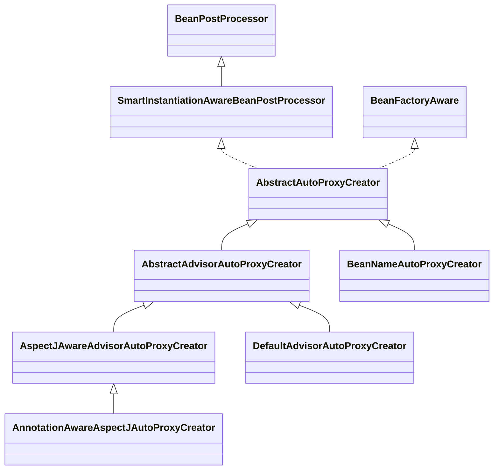

Spring AOP 是对 [AOP](https://azh3ng.com/2022/01/16/AOP.html)（面向切面编程）思想的一种实现，使开发者可以更便捷的使用各类工具完成 AOP 编程。    
AOP 中的概念并不直观，如果 Spring 重新定义一次可能更加混乱，所以 Spring 为了让开发者更加方便的做到面向切面编程，提供了一套机制，可以称之为 Spring AOP，其本质在 [Bean 创建](https://azh3ng.com/2022/01/11/Spring-BeanFactory-createBean.html) 过程的最后，判断当前 Bean 是否需要进行 AOP，如果需要则会进行 [代理模式#动态代理](https://azh3ng.com/2022/01/16/Proxy-Pattern.html#%E5%8A%A8%E6%80%81%E4%BB%A3%E7%90%86)，生成代理对象，由 Spring 管理代理对象，并在自动注入时注入代理对象，交由代理对象执行切面逻辑，完成 AOP。

**注意**：通过注解的方式定义 Pointcut 和 Advice，并不是 Spring 首创，而是 AspectJ，而且也不仅仅只有 Spring 提供了一套机制来支持 AOP，JBoss 4.0、AspectWerkz 等技术都提供了对于 AOP 的支持。Spring 使用了 AspectJ 中所定义的注解，没有再重复定义，但也仅仅只是使用了注解的定义，具体解析和处理由 Spring 实现，所以在用 Spring 时，如果想用 `@Before`、`@Around` 等 AspectJ 的注解，需要单独引入 AspectJ 相关的依赖。
```
compile group: 'org.aspectj', name: 'aspectjrt', version: '1.9.5'
compile group: 'org.aspectj', name: 'aspectjweaver', version: '1.9.5'
```

## 核心接口/类/注解

### Advice
`org.aopalliance.aop.Advice`  
Advice 接口对应着 AOP 概念中的 [AOP#Advice](https://azh3ng.com/2022/01/16/AOP.html#advice)，表示对一段代码逻辑的增强逻辑

常见的子类有
- `org.aopalliance.intercept.MethodInterceptor`：
    - `org.springframework.transaction.interceptor.TransactionInterceptor`
- `org.springframework.aop.aspectj.AbstractAspectJAdvice`
    - `AspectJAfterReturningAdvice`
    - `AspectJAfterAdvice`
    - `AspectJAroundAdvice`
    - `AspectJMethodBeforeAdvice`
    - `AspectJAfterThrowingAdvice`

#### AspectJ 中 Advice 相关注解在 Spring AOP 中对应的 API
AspectJ 中的注解，有五个用来定义 Advice，表示代理逻辑，以及执行时机，Spring 会把五个注解解析为对应的 Advice 类：
1. `@Before`：对应 Spring 中 `AspectJMethodBeforeAdvice`（继承 `MethodBeforeAdvice`）
2. `@AfterReturning`：对应 Spring 中 `AspectJAfterReturningAdvice`（继承 `AfterReturningAdvice`）
3. `@AfterThrowing`：对应 Spring 中 `AspectJAfterThrowingAdvice`（继承 `MethodInterceptor`）
4. `@After`：对应 Spring 中 `AspectJAfterAdvice`（继承 `MethodInterceptor`）
5. `@Around`：对应 Spring 中 `AspectJAroundAdvice`（继承 `MethodInterceptor`）

### Pointcut
`org.springframework.aop.Pointcut`  
Pointcut 接口对应着 AOP 概念中的 [AOP#Pointcut](https://azh3ng.com/2022/01/16/AOP.html#pointcut)，中文译为切点，可以理解为**通过一些过滤条件，筛选出需要被代理的方法**。

接口 Pointcut 中包含两个方法
- `ClassFilter getClassFilter();`
- `MethodMatcher getMethodMatcher();`

Spring AOP 通过 `ClassFilter` 和 `MethodMatcher` 判断类是否需要被代理，以及类中哪些方法需要被代理

### Advisor
`org.springframework.aop.Advisor`  
Advisor 是 [Pointcut](#pointcut) 和 [Advice](#advice) 的组合，通过 `Pointcut` 指定（筛选）被代理的类和方法，通过 Advice 自定义代理的逻辑。  
在使用 Spring 时会指定许多不同的类和方法（`Pointcut`）各自对应一段代理逻辑（`Advice`），Spring 使用 `Advisor` 持有这两者，并统一管理。

### MethodInterceptor
`org.aopalliance.intercept.MethodInterceptor`  
继承 [Advice](#advice)，可以视作比 Advice 更具象、更接近代码实现的接口，在 Spring 中大量使用。  
Spring 会将 Advice 的各种其他子类 [[适配器模式|适配]] 为 MethodInterceptor，以用于统一调用和管理。

##### 各注解对应的 MethodInterceptor
- `@Before` 对应 `AspectJMethodBeforeAdvice`，在进行动态代理时会将其转成 `MethodBeforeAdviceInterceptor`，执行顺序：
    - 先执行 advice 对应的方法
    - 再执行 `MethodInvocation.proceed()`
- `@After` 对应 `AspectJAfterAdvice`，直接实现了 `MethodInterceptor`，执行顺序
    - 执行 `MethodInvocation.proceed()`
    - 执行 advice 对应的方法
- `@Around` 对应 `AspectJAroundAdvice`，直接实现了 `MethodInterceptor`，执行顺序：
    - 直接执行 advice 对应的方法
- `@AfterThrowing` 对应 `AspectJAfterThrowingAdvice`，直接实现了 `MethodInterceptor`，执行逻辑：
    - 执行 `MethodInvocation.proceed()`
    - 如果抛出 `Throwable`，则执行 advice 对应的方法
- `@AfterReturning` 对应 `AspectJAfterReturningAdvice`，在动态代理时会将其转成 `AfterReturningAdviceInterceptor`，执行顺序：
    - 执行 `MethodInvocation.proceed()`
    - 执行被代理的方法后，得到方法的返回值
    - 执行 Advice 对应的方法

`MethodInvocation.proceed()`：如果有下一个 Interceptor，则执行下一个 Interceptor，如果没有下一个 Interceptor ，则执行 target 对应的方法

### MethodInvocation
`org.aopalliance.intercept.MethodInvocation` 继承 `org.aopalliance.intercept.Invocation` 和 `org.aopalliance.intercept.Joinpoint`  
`MethodInvocation` 可以视为【切面逻辑和目标方法的调用】的抽象，作为参数传入 `MethodInterceptor` 的 `invoke()` 方法。
`MethodInvocation.proceed()`，可以视作：调用切面逻辑和被代理的方法，其中切面逻辑可能有多个，会以链的形式逐个调用

MethodInvocation 的常见子类有：
- [ReflectiveMethodInvocation](#reflectivemethodinvocation)
- [CglibMethodInvocation](#cglibmethodinvocation)

#### ReflectiveMethodInvocation
`org.springframework.aop.framework.ReflectiveMethodInvocation`  
`ReflectiveMethodInvocation` 被用在 Spring 以 JDK 动态代理方式创建的代理类中，当代理类的代理方法被调用时，会通过 Pointcut 筛选出若干 Advise，将 Advise 适配成 `MethodInterceptor`，组装成链，后将被代理对象、被代理方法及代理逻辑链等打包传入并构造 `ReflectiveMethodInvocation`，通过 `ReflectiveMethodInvocation` 按顺序执行代理逻辑和被代理逻辑，详见 [#JDK 动态代理执行流程](#jdk-%E5%8A%A8%E6%80%81%E4%BB%A3%E7%90%86%E6%89%A7%E8%A1%8C%E6%B5%81%E7%A8%8B)

#### CglibMethodInvocation
`org.springframework.aop.framework.CglibAopProxy.CglibMethodInvocation`  
`CglibMethodInvocation` 继承 [ReflectiveMethodInvocation](#reflectivemethodinvocation)，主要被用在 Spring 以 CGLIB 方法创建的代理类中，其核心执行逻辑与 `ReflectiveMethodInvocation` 基本相同。

### AbstractAdvisorAutoProxyCreator
`org.springframework.aop.framework.autoproxy.AbstractAdvisorAutoProxyCreator`  
`AbstractAdvisorAutoProxyCreator` 继承 `AbstractAutoProxyCreator` 继承 `SmartInstantiationAwareBeanPostProcessor`。  
`AbstractAutoProxyCreator` 重写了 `postProcessAfterInitialization()` 方法，在 [Bean 创建#初始化后](https://azh3ng.com/2022/01/11/Spring-BeanFactory-createBean.html#%E5%88%9D%E5%A7%8B%E5%8C%96%E5%90%8E) 时会调用 `wrapIfNecessary()`方法，找到所有的 Advisor 类型的 bean，通过 Advisor 中 Pointcut 判断当前 Bean 是否匹配 ，如果匹配表示当前 Bean 有对应的切面逻辑，需要进行 AOP，则创建代理对象返回。  
可以理解为：如果 Spring 容器中存在这个类型的 Bean，就相当于开启了 AOP

`AbstractAdvisorAutoProxyCreator` 的常见子类包括 `DefaultAdvisorAutoProxyCreator`、[AnnotationAwareAspectJAutoProxyCreator](#annotationawareaspectjautoproxycreator)。

### @EnableAspectJAutoProxy
```java
@Target(ElementType.TYPE)  
@Retention(RetentionPolicy.RUNTIME)  
@Documented  
@Import(AspectJAutoProxyRegistrar.class)  
public @interface EnableAspectJAutoProxy {  
    boolean proxyTargetClass() default false;  
    boolean exposeProxy() default false;  
}
```

`@Import(AspectJAutoProxyRegistrar.class)` 表示 `@EnableAspectJAutoProxy` 注解向 Spring 容器中添加一个 [AnnotationAwareAspectJAutoProxyCreator](#annotationawareaspectjautoproxycreator) 类型的 Bean

### AnnotationAwareAspectJAutoProxyCreator
`org.springframework.aop.aspectj.annotation.AnnotationAwareAspectJAutoProxyCreator`



`AnnotationAwareAspectJAutoProxyCreator` 继承 [#AbstractAdvisorAutoProxyCreator](#abstractadvisorautoproxycreator) 并重写了 `findCandidateAdvisors()` 方法；  
`AbstractAdvisorAutoProxyCreator` 能找到所有 Advisor 类型的 Bean 对象，在此基础上 `AspectJAwareAdvisorAutoProxyCreator` 还能把 被 `@Aspect` 注解所标注的 Bean 中的 `@Before` 等注解及方法进行解析，生成对应的 Advisor 类型的 Bean 加入 Spring 中。

**小结**：如果 Spring 容器中存在这个类型的 Bean，就相当于开启了 AOP，同时还会自动解析 `@Before` 等 AspectJ 相关注解，并生成 Advisor 类型的 Bean。

### TargetSource
[TargetSource](https://azh3ng.com/2022/01/16/TargetSource.html)

### AdvisorAdapter
`org.springframework.aop.framework.adapter.AdvisorAdapter`  
AdvisorAdapter 有三个子类  
- `AfterReturningAdviceAdapter`
- `MethodBeforeAdviceAdapter`
- `ThrowsAdviceAdapter`
  分别将  
- `AfterReturningAdvice`
- `MethodBeforeAdvice`
- `ThrowsAdvice`

适配（转换）成 `MethodBeforeAdviceInterceptor`(继承 `MethodInterceptor`)

## Spring 与 AOP 整合
Spring 与 AOP 整合通常有两种方式：
1. 配置文件
2. 注解

通过注解方式开始 AOP 通常会使用 [@EnableAspectJAutoProxy开启AOP](#enableaspectjautoproxy开启aop)

### @EnableAspectJAutoProxy开启AOP
`@EnableAspectJAutoProxy` 注解会向 Spring 中注册 `AnnotationAwareAspectJAutoProxyCreator` 类型的 Bean，它实现了 `SmartInstantiationAwareBeanPostProcessor`，实际是向 Spring 中添加了一个 BeanPostProcessor。  
`AnnotationAwareAspectJAutoProxyCreator` 的父类 `AbstractAutoProxyCreator` 实现了 `postProcessAfterInitialization()` 方法，在 [Bean 创建#初始化后](https://azh3ng.com/2022/01/11/Spring-BeanFactory-createBean.html#%E5%88%9D%E5%A7%8B%E5%8C%96%E5%90%8E) 时，会调用到此方法。  
`postProcessAfterInitialization()` 方法中，会调用 `AbstractAutoProxyCreator.wrapIfNecessary()` 判断 Bean 是否需要 AOP，需要则生成代理 Bean：
**Spring 判断 Bean 是否需要 AOP 简述**：  
Spring 判断 Bean 是否需要进行 AOP 流程：
1. 找出所有的切面 Bean
2. 遍历切面中的每个方法，看是否写了 `@Before`、`@After` 等注解
3. 如果写了，则判断所对应的 Pointcut 和当前 Bean 的类型是否匹配
4. 如果当前 Bean 匹配 Pointcut，表示需要进行 AOP

**详述**：
1. 判断如果当前 Bean 是 Spring AOP 相关的类，则不用进行代理，包括：
    1. `org.aopalliance.aop.Advice`
    2. `org.springframework.aop.Advisor`
    3. `org.springframework.aop.Pointcut`
    4. `org.springframework.aop.framework.AopInfrastructureBean`
2. 调用 `AbstractAdvisorAutoProxyCreator.getAdvicesAndAdvisorsForBean()` 找到所有匹配的 Advisor
    5. 找到所有 `Advisor` 类型的 Bean，并通过 `beanFactory.getBean()` 实例化
    6. 找到所有 AspectJ 注解相关的 Bean，转换为 Advisor（`BeanFactoryAspectJAdvisorsBuilder.buildAspectJAdvisors()`）
        1. 查询缓存，有则返回，无则继续执行
        2. 拿到 Spring 中所有 Bean 判断 Bean 上有没有 `@Aspect` 注解，有则继续
        3. 解析 `@Aspect` 注解的 Bean 得到 `List<Advisor>` （`ReflectiveAspectJAdvisorFactory.getAdvisors()`）
            1. 找到**没有**被 `@Pointcut` 注解的方法，排序；排序规则：按 Around > Before > After > AfterReturning > AfterThrowing 排序，若类型相同则按方法名排序
            2. 遍历，找到有 AspectJ 相关注解的方法，将方法上注解内的表达式封装成 `AspectJExpressionPointcut`，再转换成 [InstantiationModelAwarePointcutAdvisorImpl](#instantiationmodelawarepointcutadvisorimpl)
        4. 存入缓存 `Map<beanName, List<Advisor>>`
    7. 将上述两步拿到的 Advisor 遍历，通过 Pointcut 内的 `ClassFilter` 和 `MethodMatcher` 对 Bean 进行匹配
    8. 如果匹配成功，添加到 `List<Advisor>` 中
    9. 将 `List<Advisor>` 根据 `@Order` 排序并返回
4. 如果有匹配的 Advisor，通过 [ProxyFactory#创建代理对象](https://azh3ng.com/2022/01/16/ProxyFactory.html#%E5%88%9B%E5%BB%BA%E4%BB%A3%E7%90%86%E5%AF%B9%E8%B1%A1)；如果没有，返回原对象

#### InstantiationModelAwarePointcutAdvisorImpl
AspectJ 相关注解的方法，会转化成 `InstantiationModelAwarePointcutAdvisorImpl`，其中 `getAdvice()` 方法会把 AspectJ 注解的方法转换成 Advice
- `@Pointcut` ：不转换
- `@Around` ：AspectJAroundAdvice
- `@Before` : AspectJMethodBeforeAdvice
- `@After` : AspectJAfterAdvice
- `@AfterReturning` : AspectJAfterReturningAdvice
- `@AfterThrowing` : AspectJAfterThrowingAdvice

## 代理对象创建流程
在 [Spring 与 AOP 整合](#spring-与-aop-整合) 中会创建 [ProxyFactory](https://azh3ng.com/2022/01/16/ProxyFactory.html)，ProxyFactory 判断并选择 CGLIB 或 JDK 动态代理，创建 AopProxy（JDK 动态代理对应 `JdkDynamicAopProxy`，CGLIB 代理对应 `ObjenesisCglibAopProxy`），通过 AopProxy 创建代理对象

### JdkDynamicAopProxy
1. 构造 JdkDynamicAopProxy 对象时，会先拿到被代理对象所实现的接口，并额外增加 SpringProxy、Advised、DecoratingProxy 三个接口，组合成一个 Class 数组，并赋值给 `proxiedInterfaces` 属性
2. 检查 `proxiedInterfaces` 接口中如果定义了 `equals()` 或 `hashcode()` 方法，也将进行代理
3. 执行 `Proxy.newProxyInstance(classLoader, this.proxiedInterfaces, this)` ，得到代理对象，JdkDynamicAopProxy 作为 InvocationHandler，代理对象在执行某个方法时，会进到 JdkDynamicAopProxy 的 [invoke()](#jdk-动态代理执行流程) 方法中

### ObjenesisCglibAopProxy
1. 创建 Enhancer 对象
2. 设置 Enhancer 的 superClass 为通过 `ProxyFactory.setTarget()` 所设置的对象的类
3. 设置 Enhancer 的 interfaces 为通过 `ProxyFactory.addInterface()` 所添加的接口，以及 SpringProxy、Advised、DecoratingProxy 接口
4. 设置 Enhancer 的 Callbacks 为 DynamicAdvisedInterceptor
5. 最后创建一个代理对象，代理对象在执行某个方法时，会进入到 `DynamicAdvisedInterceptor` 的 `intercept()` 方法中

## Spring AOP 执行流程

由于代理对象的创建分为 JDK 动态代理和 CGLIB 代理，则代理方法的执行也分为两种。

### JDK 动态代理执行流程
`org.springframework.aop.framework.JdkDynamicAopProxy#invoke`
1. 判断配置中的 exposeProxy 如果为 true，则将当前代理对象设置到 ThreadLocal 中
2. 获取所有 Advisor 中的 Pointcut，通过 Pointcut 中的 `MethodMatcher` 和 `ClassFilter` 对目标对象的方法进行匹配筛选，匹配成功则将 Advisor 适配成 MethodInterceptor（`AdvisedSupport.getInterceptorsAndDynamicInterceptionAdvice()` -> `DefaultAdvisorChainFactory.getInterceptorsAndDynamicInterceptionAdvice()`）
1. 如果 `advisor instanceof PointcutAdvisor`，则
   1. 先根据 Pointcut 定义的 `ClassFilter.matches()` 方法判断，被代理的类是否匹配
   2. 再根据 Pointcut 定义的 `MethodMatcher.matches(Method method, Class<?> targetClass)` 方法判断，被调用的方法是否匹配
   3. 如果匹配
    1. 如果 `MethodMatcher.isRuntime()` 为 ture
    1. 如果是，将 `advisor` 转换([适配](#advisoradapter))成 `InterceptorAndDynamicMethodMatcher`（在被代理的方法执行前，会根据 `MethodMatcher.matches(Method method, Class<?> targetClass, Object... args)` 方法，更细粒度的控制并判断，被调用的方法是否匹配，如果匹配成功才执行代理逻辑，详见 `org.springframework.aop.framework.ReflectiveMethodInvocation#proceed`）
    2. 否则将 `advisor` 转换([适配](#advisoradapter))成 `MethodInterceptor`
3. 把匹配的 MethodInterceptor 链、被代理对象、代理对象、代理类、当前 Method 对象、方法参数封装为 `ReflectiveMethodInvocation` 对象
4. `ReflectiveMethodInvocation.proceed()`：执行各个 MethodInterceptor 及被代理对象的方法
    1. 判断所有 MethodInterceptor 都执行完成，调用 `invokeJoinpoint()` 方法，执行被代理对象的方法并返回
    2. 取出下一个 MethodInterceptor（初始索引为 -1）
    3. 判断 MethodInterceptor 如果是 InterceptorAndDynamicMethodMatcher 类型
        1. 取出 内的 MethodMatcher 对方法进行匹配判断
            1. 如果匹配，执行 `interceptor.invoke(this)`，传入 MethodInvocation
            2. 如果不匹配，进入下一个 `MethodInterceptor.proceed()`
    4. 执行 `interceptor.invoke(this)`，传入 MethodInvocation
        1. 通常 MethodInterceptor 的 `invoke()` 方法内部会调用 `MethodInvocation.proceed()`，形成递归调用，直到将 MethodInterceptor 链都执行完成


### CGLIB 代理方式
`org.springframework.aop.framework.CglibAopProxy.DynamicAdvisedInterceptor#intercept`
1. 判断配置中的 exposeProxy 如果为 true，则将当前代理对象设置到 ThreadLocal 中
2. 获取所有 Advisor 中的 Pointcut，通过 Pointcut 中的 MethodMatcher 和 ClassFilter 对目标对象的方法进行匹配筛选，匹配成功则将 Advisor 适配成 MethodInterceptor（详见 [JDK 动态代理执行流程](#jdk-动态代理执行流程) 内步骤2）
3. 把匹配的 MethodInterceptor 链、被代理对象、代理对象、代理类、当前 Method 对象、方法参数封装为 `CglibMethodInvocation` 对象
4. `CglibMethodInvocation.proceed()`：执行各个 MethodInterceptor 及被代理对象的方法
    1. `CglibMethodInvocation` 继承 `ReflectiveMethodInvocation`，`proceed()` 内实际直接调用的父类逻辑，故流程详见 [JDK 动态代理执行流程](#jdk-动态代理执行流程) 内步骤4

## 实战
理解了 Spring AOP 的原理之后，在开发中可以使用 Spring 提供的接口更优雅快捷的完成开发

### 获取 Spring 生成的代理类
当 `@EnableAspectJAutoProxy` 中的 `exposeProxy` 属性设值为 true 时，Spring 会将当前代理对象放置到 ThreadLocal 中，开发者可以通过 AopContext 获取当前代理对象，例如：
```java
/**
 * 被代理类
 */
public class TargetProxyClazz {
    public void test() {
        TargetProxyClazz proxyClazz = (TargetProxyClazz) AopContext.currentProxy();
    }
}
```

### 使用 ProxyFactoryBean 创建代理对象
Spring 中所提供了 ProxyFactory、Advisor、Advice、PointCut 等技术来实现代理对象的创建，但是通常使用 Spring 时，并不会直接使用 ProxyFactory，通常希望产生的代理对象是被 Spring 管理的 Bean，能直接从 Spring 容器中得到。
Spring 提供了 ProxyFactoryBean 可以生成代理对象并直接被 Spring 管理，开发者只需要指定被代理类和代理逻辑。
代码示例：
```java
public class TestProxyFactoryBean {
    @Bean
    public ProxyFactoryBean azh3ngInterfaceImplProxy() {
        Azh3ngInterfaceImpl azh3ngInterfaceImpl = new Azh3ngInterfaceImpl();
        ProxyFactoryBean proxyFactoryBean = new ProxyFactoryBean();
        proxyFactoryBean.setTarget(azh3ngInterfaceImpl);
        proxyFactoryBean.addAdvice(new MethodInterceptor() {
            @Override
            public Object invoke(MethodInvocation invocation) throws Throwable {
                System.out.println("before...");
                Object result = invocation.proceed();
                System.out.println("after...");
                return result;
            }
        });
        return proxyFactoryBean;
    }
}
```
通过这种方法，可以定义 Azh3ngInterfaceImpl 类型的 Bean，Spring 会创建代理类并管理，完成了 AOP 。

ProxyFactoryBean 提供了 `setInterceptorNames()` 方法，可以传入 BeanName，在 Spring 创建代理类时会通过 BeanName 找到 Advise Bean。
```java
public class TestProxyFactoryBean {
    @Bean
    public MethodInterceptor azh3ngAroundAdvise() {
        return new MethodInterceptor() {
            @Override
            public Object invoke(MethodInvocation invocation) throws Throwable {
                System.out.println("before...");
                Object result = invocation.proceed();
                System.out.println("after...");
                return result;
            }
        };
    }

    @Bean
    public ProxyFactoryBean azh3ngInterface() {
        Azh3ngInterfaceImpl azh3engInterfaceImpl = new Azh3ngInterfaceImpl();
        ProxyFactoryBean proxyFactoryBean = new ProxyFactoryBean();
        proxyFactoryBean.setTarget(azh3engInterfaceImpl);
        proxyFactoryBean.setInterceptorNames("azh3ngAroundAdvise");
        return proxyFactoryBean;
    }
}
```

### 使用 BeanNameAutoProxyCreator 指定代理对象
`ProxyFactoryBean` 可以指定具体的被代理的对象，`BeanNameAutoProxyCreator` 通过指定 BeanName ，对 Bean 进行代理，并且允许使用通配符，可以批量的指定 Bean 进行 AOP，并且指定代理逻辑
```java
public class TestBeanNameAutoProxyCreator {
    @Bean
    public BeanNameAutoProxyCreator beanNameAutoProxyCreator() {
        BeanNameAutoProxyCreator beanNameAutoProxyCreator = new BeanNameAutoProxyCreator();
        beanNameAutoProxyCreator.setBeanNames("azh3ngSe*");
        beanNameAutoProxyCreator.setInterceptorNames("azh3ngAroundAdvise");
        beanNameAutoProxyCreator.setProxyTargetClass(true);
        return beanNameAutoProxyCreator;
    }
}
```

### DefaultAdvisorAutoProxyCreator
DefaultAdvisorAutoProxyCreator 继承 [AbstractAdvisorAutoProxyCreator](#abstractadvisorautoproxycreator)，会到 Spring 容器中寻找所有 Advisor 类型的 Bean，根据 Advisor 中的 PointCut 和 Advice 信息，确定要代理的 Bean 以及代理逻辑。  
**代码示例：**
```java
public class TestDefaultAdvisorAutoProxyCreator {
    @Bean
    public DefaultPointcutAdvisor defaultPointcutAdvisor() {
        // 可以通过自定义 Pointcut 实现更复杂的匹配逻辑
        NameMatchMethodPointcut pointcut = new NameMatchMethodPointcut();
        pointcut.addMethodName("test");
        DefaultPointcutAdvisor defaultPointcutAdvisor = new DefaultPointcutAdvisor();
        defaultPointcutAdvisor.setPointcut(pointcut);
        defaultPointcutAdvisor.setAdvice(new Azh3ngAfterReturningAdvise());
        return defaultPointcutAdvisor;
    }

    @Bean
    public DefaultAdvisorAutoProxyCreator defaultAdvisorAutoProxyCreator() {
        return new DefaultAdvisorAutoProxyCreator();
    }
}
```
但是，这种方式需要定义 Advisor 类型的 Bean，并且可能需要定义诸如 Advise 类和 Pointcut 类，`@Aspect` 可以将此步骤简化

### @Aspect
@Aspect 注解可以简化定义 Advisor Bean 、Advise、Pointcut 的步骤，简化了 AOP 的使用
**代码示例**：
```java
@Aspect
@Component
public class Azh3ngAspect {
    @Before("execution(public void com.azh3ng.service.Azh3ngInterfaceImpl.test())")
    public void azh3ngBefore(JoinPoint joinPoint) {
        System.out.println("before...");
    }
}
```
`Azh3ngAspect` 通过表达式指定了被代理的方法，以及代理逻辑（被 `@Before` 修饰的方法）  
使用 **@EnableAspectJAutoProxy** 注解可以解析 `@Aspect` 相关注解，得到对应的 Pointcut 对象（表达式）、Advice 对象（`azh3ngBefore()` 方法），生成 Advisor 对象，放进 ProxyFactory 中，进而产生对应的代理对象。

## 参考
- [Spring-AOP @AspectJ切点函数之execution()](https://blog.51cto.com/u_15239532/5203448)
- [Spring AOP Concepts](https://docs.spring.io/spring-framework/docs/current/reference/html/core.html#aop-introduction-defn)

